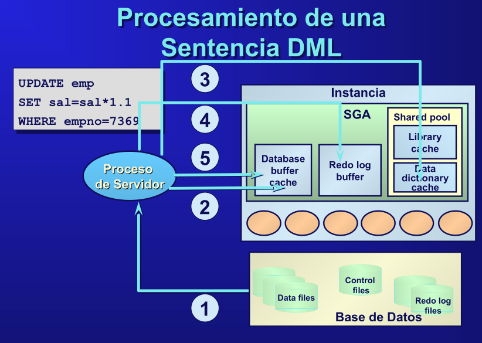

# Memoria Prácticas

##  1. Tipos de Sentencias SQL  

### DML (Data Manipulation Language) - Manipulación de Datos  
Se usa para consultar, insertar, actualizar y eliminar datos en una base de datos.  

#### Principales Sentencias DML:  
- `SELECT` → Recupera datos de una tabla.  
- `INSERT` → Inserta nuevos registros.  
- `UPDATE` → Modifica registros existentes.  
- `DELETE` → Elimina registros de una tabla.  

####  Ejemplos:  
```sql
-- Seleccionar datos
SELECT nombre, edad FROM usuarios WHERE edad > 25;

-- Insertar un nuevo usuario
INSERT INTO usuarios (id, nombre, edad) VALUES (1, 'Juan', 30);

-- Actualizar la edad de un usuario
UPDATE usuarios SET edad = 35 WHERE nombre = 'Juan';

-- Eliminar usuarios menores de 18 años
DELETE FROM usuarios WHERE edad < 18;
```
---

### DDL (Data Definition Language) - Definición de Datos  
Se usa para crear y modificar la estructura de la base de datos.  

#### Principales Sentencias DDL:  
- `CREATE` → Crea tablas, índices y bases de datos.  
- `ALTER` → Modifica la estructura de una tabla.  
- `DROP` → Elimina tablas, vistas o bases de datos.  
- `TRUNCATE` → Borra todos los datos de una tabla sin eliminar su estructura.  

#### Ejemplos:  
```sql
-- Crear una tabla
CREATE TABLE usuarios (
    id INT PRIMARY KEY,
    nombre VARCHAR(50),
    edad INT
);

-- Agregar una nueva columna a la tabla
ALTER TABLE usuarios ADD email VARCHAR(100);

-- Eliminar la tabla de usuarios
DROP TABLE usuarios;

-- Vaciar la tabla usuarios sin eliminar su estructura
TRUNCATE TABLE usuarios;
```
---

### DCL (Data Control Language) - Control de Accesos y Permisos  
Se usa para gestionar los permisos y la seguridad en la base de datos.  

#### Principales Sentencias DCL:  
- `GRANT` → Otorga permisos a usuarios.  
- `REVOKE` → Revoca permisos previamente concedidos.  

#### Ejemplos:  
```sql
-- Otorgar permisos de lectura y escritura a un usuario
GRANT SELECT, INSERT ON usuarios TO maria;

-- Revocar permisos de inserción a un usuario
REVOKE INSERT ON usuarios FROM maria;
```
---

### TCL (Transaction Control Language) - Control de Transacciones  
Se usa para manejar transacciones en la base de datos y garantizar la integridad de los datos.  

#### Principales Sentencias TCL:  
- `COMMIT` → Guarda los cambios de una transacción.  
- `ROLLBACK` → Revierte los cambios si ocurre un error.  
- `SAVEPOINT` → Crea puntos intermedios dentro de una transacción.  

#### Ejemplos:  
```sql
-- Iniciar una transacción
BEGIN;

-- Modificar datos en la tabla usuarios
UPDATE usuarios SET edad = 40 WHERE nombre = 'Ana';

-- Guardar los cambios
COMMIT;

-- Iniciar otra transacción
BEGIN;

-- Intentar modificar datos
UPDATE usuarios SET edad = 50 WHERE nombre = 'Carlos';

-- Revertir cambios si hay un error
ROLLBACK;

-- Crear un punto de guardado
SAVEPOINT sp1;

-- Hacer cambios y revertir hasta el SAVEPOINT
UPDATE usuarios SET edad = 45 WHERE nombre = 'Laura';
ROLLBACK TO sp1;
```
---

### Resumen General

| **Tipo** | **Propósito** | **Ejemplo de Sentencias** | **Afecta estructura** | **Se puede deshacer (`ROLLBACK`)?** | **Impacto inmediato** |
|----------|-------------|------------------|----------------|----------------------|------------------|
| **DML** | Manipulación de datos | `SELECT`, `INSERT`, `UPDATE`, `DELETE` | ❌ No | ✅ Sí | 🚫 No (hasta `COMMIT`) |
| **DDL** | Definición de estructuras | `CREATE`, `ALTER`, `DROP`, `TRUNCATE` | ✅ Sí | ❌ No | ✅ Sí |
| **DCL** | Gestión de permisos | `GRANT`, `REVOKE` | ❌ No | ❌ No | ✅ Sí |
| **TCL** | Control de transacciones | `COMMIT`, `ROLLBACK`, `SAVEPOINT` | ❌ No | ✅ Sí | 🚫 No (hasta `COMMIT`) |

---

## 2. Cheatsheet inicio y cierre DB

Asegurarse que el usuario _oracle_ es el que está ejecutando la shell con el comando `whoami`.

### Iniciar servicios y BD
```sql
--- Iniciar listener
lsnrctl start

--- Activar shell de SQL
sqlplus /nolog

--- Conectarse a la instancia de BD como administrador (En la SQLShell) con la contraseña ABD3oradba
connect sys as sysdba

--- Iniciar BD -> informa asignaciones de memoria para la instancia, indica que monta y abre la BD
startup

--- Para salir de la SQLshell 
exit

--- Iniciar Oracle Enterprise Manager(opcional)
emctl start dbconsole
```

### Detener BD y servicios
``` sql
--- Detener Oracle Enterprise Manager(opcional)
emctl stop dbconsole

--- Abrimos shell de SQLPlus con la contraseña
sqlplus sys as sysdba

--- En la SQLShell derribamos BD -> informa que cierra y desmonta BD, derriba instancia
shutdown immediate
exit

--- Derribar listener
lsnrctl stop
```

---

## 🔹 1. Introducción a la Administración de Bases de Datos  
El administrador de bases de datos (DBA) tiene como tareas principales:  
- 📌 **Gestión de la disponibilidad** de la BD.  
- 📌 **Planificación y creación** de bases de datos.  
- 📌 **Gestión del almacenamiento** y estructuras físicas.  
- 📌 **Gestión de la seguridad**.  
- 📌 **Administración de red**.  
- 📌 **Backup y recuperación** de datos.  
- 📌 **Ajuste del rendimiento** de la BD.  

---

## 🔹 2. Componentes de la Arquitectura de Oracle  
Los elementos clave de la arquitectura de Oracle incluyen:  
- **Servidor Oracle** 🖥️: Maneja las solicitudes de los clientes.  
- **Proceso de Usuario o Cliente** 👤: Se ejecuta en la máquina cliente e invoca aplicaciones como SQL*Plus.  
- **Proceso de Servidor** 🛠️: Se ejecuta en la máquina servidora y procesa las llamadas del cliente.  
- **Instancias Oracle** ⚙️: Son el mecanismo para acceder a una base de datos Oracle.  
- **Base de Datos Oracle** 🗄️: Contiene archivos de control, logs redo, datos y parámetros.  

---

## 🔹 3. Procesamiento de Consultas y Sentencias  
### 📌 Procesamiento de una Consulta  
1️⃣ Analizar la sentencia.  
2️⃣ Ejecutar la consulta.  
3️⃣ Obtener los resultados.  

```sql
SELECT * FROM emp ORDER BY ename;
```

### 📌 Procesamiento de una Sentencia DML  
1️⃣ Se envía la instrucción al servidor.  
2️⃣ Se almacena en el buffer de la BD.  
3️⃣ Se registra en el log de Redo.  
4️⃣ Se confirma la ejecución.  

```sql
UPDATE emp SET sal = sal * 1.1 WHERE empno = 7369;
```

### 📌 Procesamiento de un COMMIT  
1️⃣ Se actualizan los buffers.  
2️⃣ Se escribe en los logs de Redo.  
3️⃣ Se confirma la transacción.  

```sql
COMMIT;
```

---

## 🔹 4. Estructuras de Memoria de Oracle  
- **Shared Pool** 🧠: Contiene el diccionario de datos y la caché de sentencias SQL.  
- **Buffer Cache** 📌: Almacena bloques de datos usados recientemente.  
- **Program Global Area (PGA)** 💾: Memoria no compartida con información de sesión y estado de cursores.  
- **Redo Log Buffer** 🔁: Guarda los cambios antes de escribir en disco.  

---

## 🔹 5. Procesos en Oracle  
- **DBWR (Database Writer)** 📝: Escribe los datos modificados en los archivos de la BD.  
- **LGWR (Log Writer)** ✍️: Registra los cambios en los archivos de Redo Logs.  
- **SMON (System Monitor)** 🛠️: Recupera la base de datos en caso de fallo.  
- **PMON (Process Monitor)** 🔄: Limpia procesos fallidos y libera recursos.  

---



## 🔹 6. Resumen General  
| **Componente**  | **Descripción** |
|-----------------|----------------|
| **Instancia**   | Grupo de procesos y memoria que gestiona la BD. |
| **SGA**         | Memoria compartida con caches y buffers. |
| **PGA**         | Memoria privada de cada proceso de servidor. |
| **Buffer Cache** | Almacena los bloques de datos usados recientemente. |
| **Shared Pool**  | Contiene SQL, PL/SQL y metadatos de BD. |
| **Redo Log**     | Registro de cambios en la BD para recuperación. |

---
